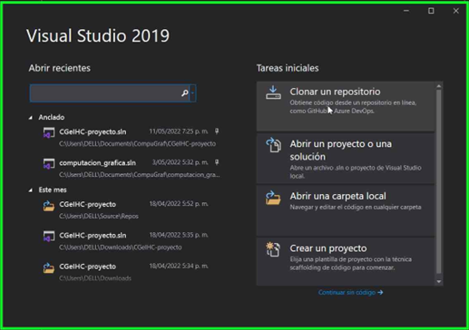
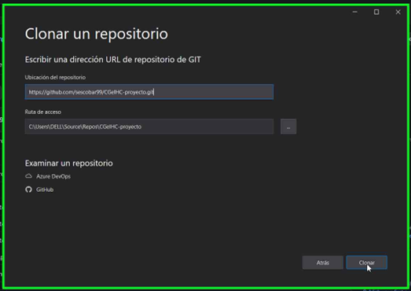
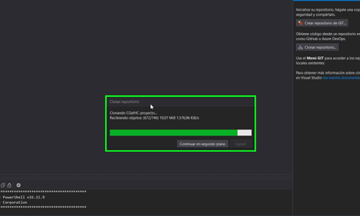
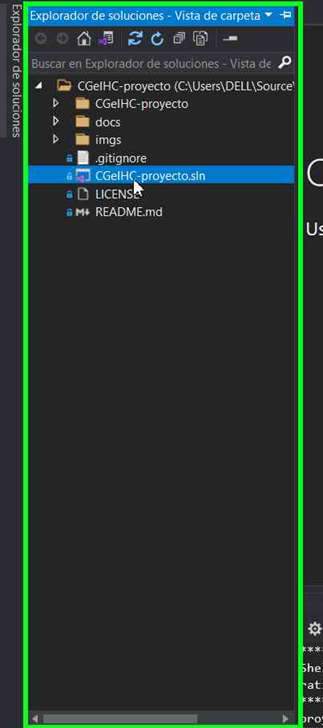
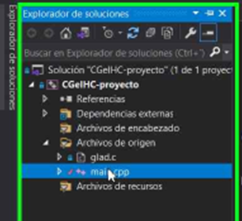
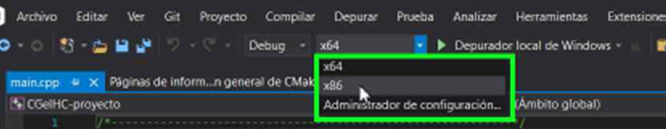
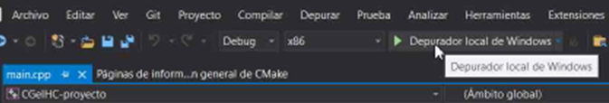

# CGeIHC-proyecto

### Final Project for "Computacion Grafica e Interaccion Humano Computadora" class. UNAM Spring Semester 2022

* As the members of the team were in different classes, there are 3 guidelines documents. [Guidelines Aldair (Lab)](docs/Lineamientos%20Proyecto%20Lab-Aldair.pdf) , [Guidelines Luis (Lab)](docs/Lineamientos%20Proyecto%20Lab-Luis.pdf), [Guidelines Arturo (Lect)](docs/Lineamientos%20Proyecto%20Teoria-Arturo.pdf).
* The project proposal can be found [here](docs/Propuesta.pdf)
* The User documentation can be found [here](docs/UserDocs.md). [Pdf version](docs/UserDocs.pdf).
* The Technical documentation can be found [here](docs/TechnicalDocs.md).
* Backup video [demo 1](vids/video_backup_01.mkv)
* Backup video [demo 2](vids/video_backup_02.mkv)
* Backup video [demo 3](vids/demo3.mp4) [PENDING]
* A setup video can be found [here](vids/setup.mkv)

---

## Project Setup

This project has been developed, built, executed, downloaded, and tested using Visual Studio 2019 (Having "Desktop development with C++" workload installed and active). Hence, to improve compatibility, it is recommended to use the same version.

1. Open Visual Studio. This menu will show up. You should select "Clone a repository" (right column) as shown in the image.  
2. Paste the repository URL "https://github.com/sescobar99/CGeIHC-proyecto.git" and click Clone. (The other fields can be left as default)  
3. This will download and open the repository locally. It may take some time. . 
4. Look for the solution explorer tool window, then select and open(double click) the file named "CGeIHC-proyecto.sln". This will load the project.  
5. Open the "main.cpp" file (double click it).  
6. At the top bar change the  platform to x86.  
7. Since the program settings have been preloaded when downloading and importing the project from GitHub, you should be able to run it directly. (Click the green arrow or press "F5").  

### Troubleshooting
* The irrKlang library may not load properly at first. In such a case it is possible to fix it by repeating step 6, changing from x86 to x64 and back to x86
  
---

## Acknowledgments

### Textures
* Floor texture - (FLOORSVARIOUS0033) took from: https://www.textures.com/download/FloorsVarious0033/24632
* Grass texture - (Grass0157) took from: https://www.textures.com/download/Grass0157/49062
* Bricks texture - (BrickSmallNew0123) took from: https://www.textures.com/download/BrickSmallNew0123/111852
* Volcano texture - (RockRough0001) took from: https://www.textures.com/download/RockRough0001/38669
* Ocenan texture - (WaterPlain0012) took from: https://www.textures.com/download/WaterPlain0012/9438
* Beach texture - (SoilBeach0131) took from: https://www.textures.com/download/SoilBeach0131/106132
* Stadiumgate texture - (DoorsMetalBig0245) took from: https://www.textures.com/download/DoorsMetalBig0245/79191
* House texture - (HouseWooden0026) took from: https://www.textures.com/download/HouseWooden0026/111815
* Roof texture - (RooftilesCeramicOld0097) took from: https://www.textures.com/download/RooftilesCeramicOld0097/56289

  ### 3D Models
* Tree01 - "Low Poly Tree"(https://skfb.ly/ooBRz) by Šimon Ustal is licensed under Creative Commons Attribution (http://creativecommons.org/licenses/by/4.0/).
* Tree02 - "Banana Plant" (https://skfb.ly/o99xU) by evolveduk is licensed under Creative Commons Attribution (http://creativecommons.org/licenses/by/4.0/).
* T-rex - took from: https://www.turbosquid.com/es/3d-models/t-rex-fbx-free/933905
* Apatosaurus(arlo) - took from: https://www.turbosquid.com/es/3d-models/3d-arlo-good-dinosaur-model-1701149
* Fence - took from: https://www.turbosquid.com/es/3d-models/3d-metal-fence-1393026#
* Ankylosaurus- "Dino - Ankylosaurus" (https://skfb.ly/6wMs7) by pikabobalex is licensed under Creative Commons Attribution (http://creativecommons.org/licenses/by/4.0/).
* Triceratops - "Triceratops Photogrammetry test" (https://skfb.ly/6qEDP) by Nick G. Gizelis is licensed under Creative Commons Attribution (http://creativecommons.org/licenses/by/4.0/).
* Pterosaur - "Lego Pteronadon + Baby Ptero" (https://skfb.ly/o9DyF) by rabuhadavid is licensed under Creative Commons Attribution (http://creativecommons.org/licenses/by/4.0/).
* Helicopter - "Low Poly Helicopter" (https://skfb.ly/6AOHw) by antonmoek is licensed under Creative Commons Attribution (http://creativecommons.org/licenses/by/4.0/).
* Helipad - "Helipad" (https://skfb.ly/6ANDS) by srockzv is licensed under Creative Commons Attribution (http://creativecommons.org/licenses/by/4.0/).
* Velociraptor - "Lego Velociraptor" (https://skfb.ly/oupnJ) by rabuhadavid is licensed under Creative Commons Attribution (http://creativecommons.org/licenses/by/4.0/).
* Gate - "Jurassic Park Gate" (https://skfb.ly/6SZS6) by Elin is licensed under Creative Commons Attribution (http://creativecommons.org/licenses/by/4.0/).
* Buggy - "Buggy_2" (https://skfb.ly/6UxxX) by Rzyas is licensed under Creative Commons Attribution (http://creativecommons.org/licenses/by/4.0/).
* "Restaurant" - "Street Food Vendor Challenge - Kokorec" (https://skfb.ly/6TRMT) by Berk Gedik is licensed under Creative Commons Attribution (http://creativecommons.org/licenses/by/4.0/).
* Hotel - "Hotel Adriano - 1h 30min speed model" (https://skfb.ly/o8VUO) by Seafoam is licensed under Creative Commons Attribution (http://creativecommons.org/licenses/by/4.0/).
* "Train Track - Modular Pack" (https://skfb.ly/UEVF) by Digital Goblin is licensed under Creative Commons Attribution (http://creativecommons.org/licenses/by/4.0/).
* "Loco" (https://skfb.ly/G7SS) by Willy Decarpentrie is licensed under Creative Commons Attribution (http://creativecommons.org/licenses/by/4.0/).
* "Railway Signal Box No. 57 (Free)" (https://skfb.ly/onuTS) by Balaclava3DStudio is licensed under Creative Commons Attribution-NonCommercial (http://creativecommons.org/licenses/by-nc/4.0/).
* Shop01 - "Abandoned Shop/mall" (https://skfb.ly/6UwZA) by Thunder is licensed under Creative Commons Attribution-ShareAlike (http://creativecommons.org/licenses/by-sa/4.0/).
* Shop02 - "shop" (https://skfb.ly/6YUUA) by kaya1 is licensed under Creative Commons Attribution (http://creativecommons.org/licenses/by/4.0/).
* Mosasaur - "мозазавр mosasaur" (https://skfb.ly/o98xq) by victory_mirosya is licensed under Creative Commons Attribution (http://creativecommons.org/licenses/by/4.0/).
* Rock - "A Simple Rock" (https://skfb.ly/QqvP) by Ozonek is licensed under Creative Commons Attribution (http://creativecommons.org/licenses/by/4.0/).
  
### Animations
* Worker animation took from https://www.mixamo.com

### Scaffold

* Project scaffold took from "LCGeIHC" class material. Provided by Luis Sergio Valencia Castro
### Sound
* Irrkland audio library. Copyright © Nikolaus Gebhardt / Ambiera 2001-2018.
* Mystic Forest - Music from Uppbeat (free for Creators!):
https://uppbeat.io/t/ak/mystic-forests
License code: F9DNLDXJEF9YLCXB
* John Williams & Vienna Philharmonic – Williams: Theme from “Jurassic Park”
Discover©