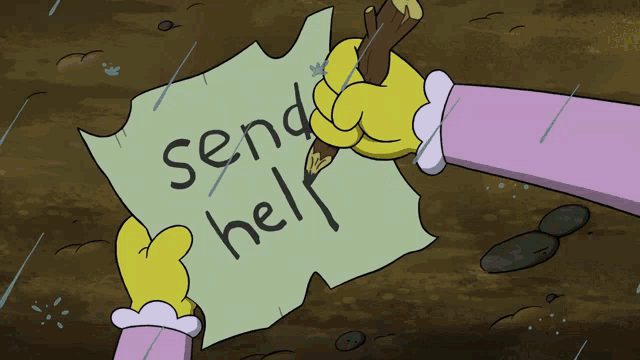
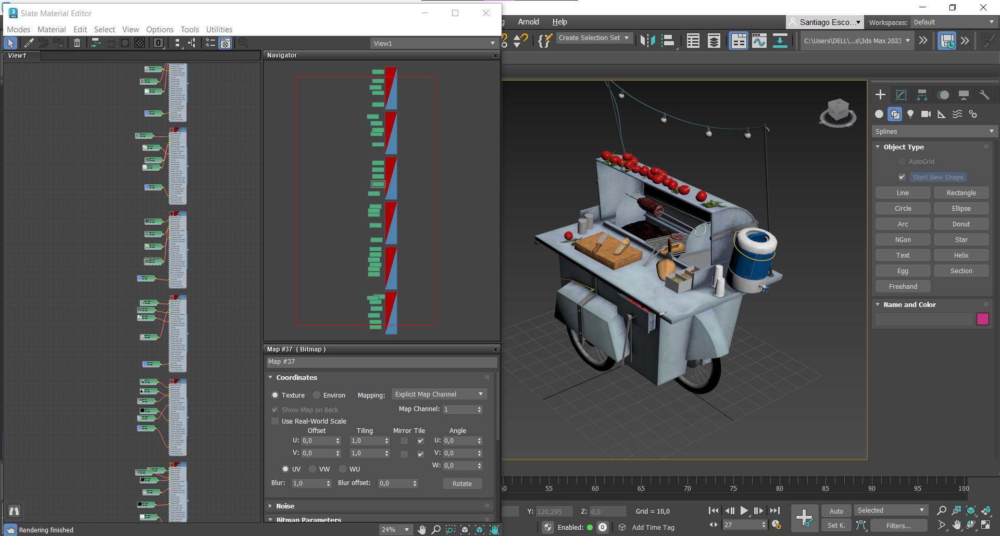

# Index <!-- omit in toc -->

- [Planned Vs Achieved](#planned-vs-achieved)
  - [Adherence to schedule](#adherence-to-schedule)
    - [Planned](#planned)
      - [First milestone](#first-milestone)
      - [Second milestone](#second-milestone)
      - [Third milestone](#third-milestone)
    - [Achieved](#achieved)
  - [Spatial distribution](#spatial-distribution)
    - [Planned](#planned-1)
    - [Achieved](#achieved-1)
  - [3D Models](#3d-models)
  - [Animations](#animations)
    - [Complex](#complex)
    - [Non-complex](#non-complex)
- [Project budget and costs estimate](#project-budget-and-costs-estimate)
- [Personal essay/comments referring to experience carrying out the project](#personal-essaycomments-referring-to-experience-carrying-out-the-project)
    - [Team member 1 (Santiago)](#team-member-1-santiago)
- [Work Evidences](#work-evidences)
- [Complex animations technical details](#complex-animations-technical-details)
    - [Mosasaurus](#mosasaurus)
    - [Helicopter](#helicopter)
    - [Pterosaur](#pterosaur)
    - [Tyrannosaur](#tyrannosaur)
    - [Train](#train)

# Planned Vs Achieved

## Adherence to schedule
**[PENDING]**
* Include individual and group responsibilities
### Planned
#### First milestone
#### Second milestone
#### Third milestone

### Achieved

## Spatial distribution
 
### Planned

### Achieved

## 3D Models
- [X] Trees
- [X] Rocks
- [X] People
- [X] Volcano
- [X] Helicopter
- [X] Helipad
- [X] Buggy vehicle
- [X] Park fence 
- [X] Park gate 
- [X] Houses
- [X] Hotel
- [X] Restaurant
- [X] Gift shop
- [X] Mosasaurus
- [X] Mosasaurus enclosure
- [X] T-rex
- [X] T-rex enclosure
- [X] Triceratops
- [X] Apatosaurus
- [X] Pterosaur
- [X] Ankylosaurus
- [X] Velociraptor
- [X] Train + railroad

## Animations
**[UNACCOMPLISHED]**
### Complex
- [ ] Mosasaurus "jumping" and catching a prey
- [ ] Helicopter takeoff, island ride and landing
- [ ] Pterosaur flying around the volcano
- [ ] T-rex tied up
- [ ] Three wagon train touring along the park

### Non-complex
- [ ] Buggy ride
- [ ] Volcanic ash/smoke

# Project budget and costs estimate

This information can be found here: [Propuesta.pdf](Propuesta.pdf)

# Personal essay/comments referring to experience carrying out the project

### Team member 1 (Santiago)
This was a project with a little bit of everything, good, not so good, and bad things.

Among the good things were the exposure to topics of my interest, the discovery of new perspectives, and the deepening of some concepts.   Some of the regular I could mention that -for diverse reasons- I devoted less time to the project than I was supposed to, which led to the bad things.  Putting together the lack of dedication and poor communication as well as the poor teamwork resulted in a crunch situation, which is not good for either the completion of the project or the well-being of anybody involved in the project. 
This is evident in the project results, which as I discussed (at least I hope to have been able to achieve) in the "adherence to the schedule" section was a release missing some important elements, features, and functionalities.
I can finally say that I keep with me the knowledge, the passion, and enjoyment of the subjects and tools covered - including computer graphics theory, animation, 3d modeling, use of Blender, and 3dsmax -, as well as greater skills than the ones I had when I started.
Thank you so much, pardon me for so little.

# Work Evidences

* Gimp 
* 3DSMAX 
* Blender 
* Github 
* Trello 
# Complex animations technical details
**[UNACCOMPLISHED]**

### Mosasaurus
### Helicopter

### Pterosaur

### Tyrannosaur

### Train

