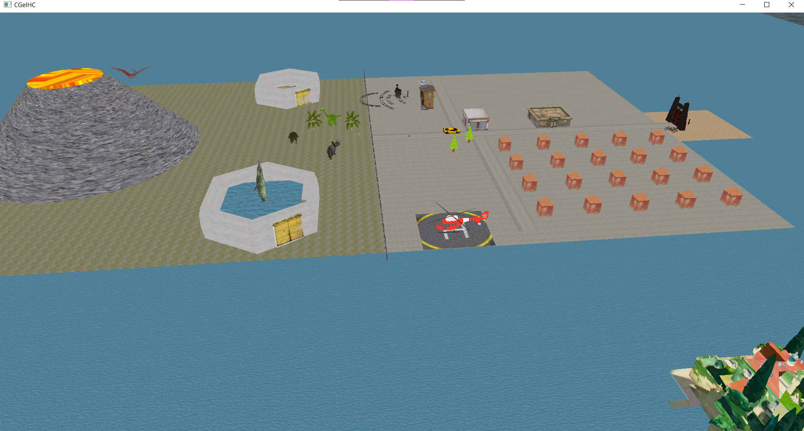

# Index <!-- omit in toc -->
- [Brief introduction](#brief-introduction)
- [Map](#map)
- [How to move and explore](#how-to-move-and-explore)
- [Included elements](#included-elements)
  - [Trees](#trees)
  - [Rocks](#rocks)
  - [People](#people)
  - [Volcano](#volcano)
  - [Helipad + helicopter](#helipad--helicopter)
  - [Vehicle (buggy)](#vehicle-buggy)
  - [The Wall](#the-wall)
  - [Park entrance (gate)](#park-entrance-gate)
  - [Houses](#houses)
  - [Hotel](#hotel)
  - [Restaurant](#restaurant)
  - ["Gift shop"](#gift-shop)
  - [Dinosaurs](#dinosaurs)
    - [T-rex](#t-rex)
    - [Triceratops](#triceratops)
    - [Apatosaurus](#apatosaurus)
    - [Pterosaur](#pterosaur)
    - [Ankylosaurus](#ankylosaurus)
    - [Velociraptor](#velociraptor)
    - [Mosasaurus](#mosasaurus)
- [Animations](#animations)
  - [Mosasaurus](#mosasaurus-1)
  - [Pterosaur](#pterosaur-1)
  - [Tyrannosaur](#tyrannosaur)
  - [Train](#train)
  - [Helicopter](#helicopter)
- [Park overview](#park-overview)

## Brief introduction

The objective of this project was to recreate an amusement/dinosaur park using computer graphics techniques. To do it, we proposed a design with different zones which included dinosaurs and several buildings of interest.

You (the user) are encouraged to explore the virtual scene using the provided map, controls, and list of elements.

## Map

The island is divided into two main zones.

The safari area (green one) has a volcano, the tyrannosaurus, and mosasaurs cages, and a train touring them all.

In the other one, the commercial area (gray) you can find a restaurant, housing, a hotel, and a gift shop.

Here is an aerial picture of the island

 

## How to move and explore

You can move forward, backward, and sidewards using "WASD" keys
* W: Forward
* S: Backward
* A: Leftward
* D: Rightward

You can also rotate the camera view using the mouse cursor. If you move it up, the camera will rotate upwards. If you move it down, the camera will rotate downwards, and so on.

**Beware** of the 3dimensional movements. This means that depending on where the camera is pointing using WASD keys will move you on a different axis

The "P" key toggles the background music

## Included elements

### Trees

### Rocks

### People

### Volcano

### Helipad + helicopter

### Vehicle (buggy)

### The Wall

### Park entrance (gate)

### Houses

### Hotel

### Restaurant

### "Gift shop"

### Dinosaurs

#### T-rex

#### Triceratops

#### Apatosaurus

#### Pterosaur

#### Ankylosaurus

#### Velociraptor

#### Mosasaurus

## Animations
**[UNACCOMPLISHED]**

### Mosasaurus

### Pterosaur

### Tyrannosaur

### Train

### Helicopter

## Park overview

* Park entrance & commercial area 
* Hotel & Helicopter 
* Safari area 